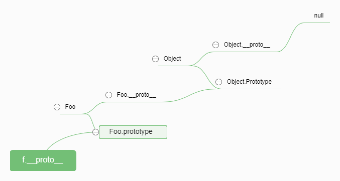

## 1. 对象
定义：对象是一组键值对的集合
### 1.1声明对象的方式

```
// 1) 构造函数 Object 
const obj = new Object()
// 2) 对象字面量(推荐)
const obj2 = {}

```
### 1.2 对象特征
对象特征：可自由拓展属性(property)

```
const obj = {
    a : '属性a'
  }

// 也可通过`.`声明属性
obj.b = '属性b'
// 通过`.`访问属性对应的值

console.log(obj.a)  // 属性a
console.log(obj.b)  // 属性b
```
### 1.3 hasOwnProperty
`hasOwnProperty(propertyName)` 用于判断对象是否是自己的属性(而非原型链上的属性)
```
obj.hasOwnProperty(a)  // true
obj.hasOwnProperty(constructor)  // false
```
## 2.构造函数
作用：主要用于构造对象，提高代码复用性
声明一个构造函数
```
// 通常构造函数的函数名都为大写字母开头
function Animal(name,age){
  this.name = name
   this.age = age
   // return this (默认)
}

// 通过 Animal 构造函数来创建实例(对象)
const cat = new Animal('Tom',5)

```
上面的代码除了构造函数的声明外，`new`操作符是最为关键的一点，下面是`new`工作的内容
- 1. 创建一个空对象 `obj`,它继承自`Animal.prototype`(`obj.__proto__ = Animal.prototype`)
- 2. 执行构造函数，同时`this`会指向`obj`
- 3. 判断执行构造函数的返回值
- 4. 步骤3如果返回对象那么返回该对象(`obj`)
-----------------------------------------------------------------------
而`cat`的属性构造函数`constructor`(该属性用来标识对象类型)指向`Animal`
```
cat.constructor === Animal
```

## 3. 原型
首先明确几点，所以引用类型都具有以下特点：
- 1. 都可自由拓展属性
- 2. 都有一个`__proto__`(隐式原型)属性，属性值为一个对象(不要直接操作属性)
- 3. 其`__proto__`指向它构造函数的`prototype`属性，其值同理
函数具有以下特点：
- 1. 包含一个 `prototype`(显示原型)属性

原型规则：
当对象试图访问某个属性时，如果对象本身没有该属性，那么它会去自身的`__prototype__`(即构造函数的`ptototype`)中去查找

## 4.原型链
要理解`原型链`,必须清楚`__proto__`，`prototype`之间的关系
```
const Foo = function() {}
const f = new Foo()
```
- 1. 实例(f)的的`__proto__`指向构造函数(Foo)的`prototype`属性
```
f.__proto__ === Foo.prototype
```
- 2.特殊情况：为避免出现死循环，`Object`的`__proto__`指向`null`
因此由`f.__proto__`起一直到`null`这条就称为原型链


## 5. 确定实例与原型的关系(引用类型属于哪个构造函数)
通常使用`instanceof`来确定关系
```
f instanceof Foo   // true
```
其判断的基本思路是，判断`f`沿着(原型链)`__proto__`往上找，看是否能够找到`Foo.prototype`,找到返回`true`,反之返回`false`

## 6. 继承

`JavaScript`中的继承主要依靠原型链进而实现的
下面是一个模仿`jQuery`实现部分原理的继承例子
```
function Ele(id){
  this.ele = document.querySelector(id)
}

Ele.prototype = {
  // 获取/根据 参数txt 设置实例的innerHTML内容
  html(txt) {
    // 获取实例对象
    const _this = this.ele
    // 判断是否包含参数
    if (txt){
      // 赋值
      _this.innerHTML = txt
      // 提供链式操作
      return this
    } else {
      // 返回innerHTML 信息
      return _this.innerHTML
    }
  },
  // 绑定点击事件event：必须，事件类型；fn：必须，回调函数 ；capture：是否使用捕获，默认不不使用及为false
  on(event, fn, capture = false){
    if(arguments.length < 2) return console.error('参数错误')
    // 获取实例对象
    const _this = this.ele
    // 绑定事件
    _this.addEventListener(event, fn ,capture)
    // 提供链式操作
    return this
  }
}
```